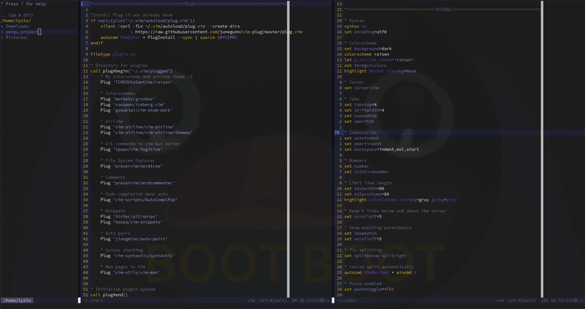

# Tyzlo's Vim config
This is the new vimrc I wrote for my new virtual machine, I hope you will like it!



## Included Plugins
I used `Vim-plug` to manage the plugins.

- [vim-airline](https://github.com/vim-airline/vim-airline): status line at the bottom
- [vim-airline-theme](https://github.com/vim-airline/vim-airline-themes): add theme for the airline
- [vim-fugitive](https://github.com/tpope/vim-fugitive): better git commands in vim (quiet commands)
- [nerdtree](https://github.com/preservim/nerdtree): file system explorer
- [nerdcommenter](https://github.com/preservim/nerdcommenter): fast commenting
- [AutoComplPop](https://github.com/vim-scripts/AutoComplPop): automatically open the code completion menu
- [ultisnips](https://github.com/SirVer/ultisnips): snipets for vim
- [auto-pairs](https://github.com/jiangmiao/auto-pairs): insert or delete brackets, parenthesis and quotes in pair
- [Syntastic](https://github.com/vim-syntastic/syntastic): syntax checking and error display
- [vim-man](https://github.com/vim-utils/vim-man): open man pages in vim
- [vim-css-colors](https://github.com/ap/vim-css-color): color preview

## Included color schemes
- [gruvbox](https://github.com/morhetz/gruvbox)
- [iceberg](https://github.com/cocopon/iceberg.vim)
- [vim-atom-dark](https://github.com/gosukiwi/vim-atom-dark)

## Key Mappings
I set the `Leader key` to `Space`.

`Ctrl+h` go to the left split
```
map <C-h> <C-w>h
```

`Ctrl+l` go to the right split
```
map <C-l> <C-w>l
```

`Ctrl+m` create a vertical split
```
noremap <C-M> :vs<CR>
inoremap <C-M> <Esc>:vs<CR><C-M>
```

`Ctrl+t` create a new tab
```
noremap <C-T> :tabnew<CR>
inoremap <C-T> <Esc>:tabnew<CR>
```

`ii` Normal mode from Insert mode faster
```
inoremap ii <Esc>
```

`Ctrl+j` move down current or selected line(s)
```
nnoremap <C-j> :m .+1<CR>
vnoremap <C-j> :m '>+1<CR>gv=gv
```

`Ctrl+k` move up current or selected line(s)
```
nnoremap <C-k> :m .-2<CR>
vnoremap <C-k> :m '<-2<CR>gv=gv
```

`Ctrl+i` fix the indent in the whole file
```
noremap <C-I> gg=G
```

`Ctrl+s` save the current file
```
noremap <C-S> :w<CR>
inoremap <C-S> <Esc>:w<CR>
```

`Ctrl+x` quit the current file
```
noremap <C-X> :q<CR>
inoremap <C-X> <Esc>:q<CR>
```

`Ctrl+f` Toggle NerdTree
```
nnoremap <C-f> :NERDTreeToggle<CR>
```

## Other cool things I use a lot when I code
`s` in NerdTree, open the selected file in a new split

`r` in NerdTree, refresh the tree

`g;` go to the last position where something has been edited

`zz` in Normal mode, place the cursor at the middle of the screen

`Ctrl+d` in Normal mode jump half a page down

`Ctrl+u` in Normal mode, jummp half a page up

`Ctrl+wr` in Normal mode, rotate the split rightward

`Leader+cc` comment the current or selected line(s)

`Leader+cu` uncomment the current or selected line(s)

`<` indent to the left the current or selected line(s)

`>` indent to the right the current or selected line(s)

`Ctrl+p` in code completion menu, select the previous entry

`Ctrl+n` in code completion menu, select the next entry
